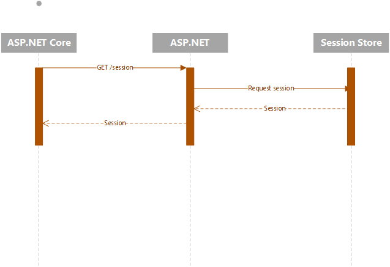
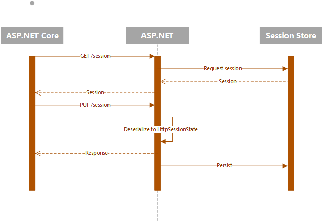

# Remote App Session State

Remote app session state will enable communication between the ASP.NET Core and ASP.NET app and to retrieve the session state. This is enabled by exposing an endpoint on the ASP.NET app that can be queried to retrieve and set the session state.

## Configuration

In order to configure it, both the framework and core app must set an API key as well as register known app settings types. These properties are:

- `ApiKeyHeader` - header name that will contain an API key to secure the endpoint added on .NET Framework
- `ApiKey` - the shared API key that will be validated in the .NET Framework handler
- `RegisterKey<T>(string)` - Registers a session key to a known type. This is required in order to serialize/deserialize the session state correctly. If a key is found that there is no registration for, an error will be thrown and session will not be available.

Configuration for ASP.NET Core would look similar to the following:

```csharp
builder.Services.AddSystemWebAdapters()
    .AddRemoteAppSession(options =>
    {
        options.RemoteApp = new(builder.Configuration["ReverseProxy:Clusters:fallbackCluster:Destinations:fallbackApp:Address"]);
        options.ApiKey = "test-key";
        options.RegisterKey<int>("test-value");
        options.RegisterKey<SessionDemoModel>("SampleSessionItem");
    });
```

The framework equivalent would look like the following change in `Global.asax.cs`:

```csharp
Application.AddSystemWebAdapters()
    .AddRemoteAppSession(options=>
    {
        options.ApiKey = "test-key";
        options.RegisterKey<int>("test-value");
        options.RegisterKey<SessionDemoModel>("SampleSessionItem");
    });
```
# Protocol

## Readonly
Readonly session will retrieve the session state from the framework app without any sort of locking. This consists of a single `GET` request that will return a session state and can be closed immediately.



## Writeable

Writeable session state protocol starts with the the same as the readonly, but differs in the following:

- Requires an additional `PUT` request to update the state
- The initial `GET` request must be kept open until the session is done; if closed, the session will not be able to be updated

